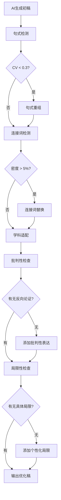

# AI痕迹消除技术指南

## 一、AI文本特征识别

### 1.1 典型AI写作特征

| 特征维度 | AI文本特点 | 人类文本特点 |
|---------|-----------|-------------|
| **句式结构** | 句式长度均匀，多为20-25字 | 长短句交错，10-40字不等 |
| **连接词** | 高频使用"此外""然而""因此" | 多样化连接词，同义替换频繁 |
| **段落组织** | 段落长度一致（4-6句） | 段落有长有短，根据内容调整 |
| **词汇选择** | 正式词汇堆砌，缺乏变化 | 口语化与正式语交替 |
| **观点表达** | 绝对化表述多 | 限定词多，谨慎表述 |
| **逻辑推进** | 线性推进，过渡平滑 | 有跳跃性，强调重点 |

### 1.2 AI痕迹检测指标

```python
# AI检测核心指标
detection_metrics = {
    "句子长度变异系数": {
        "计算": "CV = 标准差 / 均值",
        "阈值": "CV < 0.3 提示AI痕迹",
        "优化": "主动制造长短句差异"
    },
    "连接词密度": {
        "计算": "连接词数 / 总词数",
        "阈值": "> 5% 提示过度使用",
        "优化": "替换为隐性连接或多样化表达"
    },
    "被动语态比例": {
        "工科阈值": "≥ 60%",
        "社科阈值": "30-50%",
        "偏离提示": "偏离学科习惯可能为AI生成"
    },
    "词汇多样性": {
        "计算": "TTR (Type-Token Ratio)",
        "阈值": "TTR > 0.7 提示机械重复",
        "优化": "引入同义词、近义词"
    }
}
```

---

## 二、降AI味核心策略

### 2.1 思维过程模拟

**策略原理**：让AI模拟人类学者的思考路径，生成中间产物后再整合成文。

**实施步骤**：

```
步骤1：深度提问收集
    ↓ 用户输入主题
    ↓ AI提出3-5个细化问题
    ↓ 收集具体细节和个人观点
    
步骤2：大纲构建
    ↓ 基于回答构建思维导图式大纲
    ↓ 标注每部分的核心论点
    
步骤3：分段生成
    ↓ 按大纲逐段生成
    ↓ 每段加入"思考痕迹"
    
步骤4：批判性润色
    ↓ 添加反向论证
    ↓ 指出研究局限
```

**示例对比**：

| 阶段 | 内容 |
|------|------|
| AI直出 | "社交媒体使用对青少年心理健康有负面影响。" |
| 降AI处理后 | "尽管多项研究指出社交媒体与青少年心理困扰存在关联（Twenge et al., 2018），但这一结论仍需谨慎对待——本研究采用横截面设计，难以确立因果关系；此外，社交媒体使用的积极面向（如社会支持获取）在本研究中未充分探讨，这可能限制了结论的完整性。" |

### 2.2 批判性思维注入

**批判性表达模板**：

```python
critical_templates = {
    "文献综述": [
        "尽管{作者}（{年份}）的研究在{某方面}取得了显著进展，但其研究设计存在{某局限}，这可能影响了{某结论}的可靠性。",
        "需要指出的是，现有研究在{某领域}尚未达成一致，{作者A}（{年份}）认为{观点A}，而{作者B}（{年份}）则提出{观点B}，这种分歧暗示了{某问题}的复杂性。",
        "从现有文献来看，{某主题}的研究多集中于{某视角}，而对{另一视角}的关注相对不足，这一空白为本研究提供了切入点。"
    ],
    "方法论": [
        "本研究采用{某方法}，虽然该方法在{某方面}具有优势，但我们也意识到其可能存在的局限，如{某局限}。",
        "为了尽可能控制{某混淆变量}，本研究采取了{某措施}，尽管如此，{某潜在问题}仍可能对结果产生一定影响。",
        "受限于{某条件}，本研究的样本主要来源于{某群体}，这在一定程度上限制了结论向{某群体}的推广。"
    ],
    "结果讨论": [
        "这一发现与{某理论}的预测一致，然而，考虑到{某因素}，我们倾向于以更为谨慎的态度解读这一结果。",
        "值得注意的是，{某结果}仅在{某条件}下显著，这暗示了{某变量}与{某结果}之间的关系可能受到{某调节因素}的影响。",
        "虽然本研究未能发现{某假设}的支持证据，但这一"零结果"本身也具有启示意义——它提示我们可能需要重新审视{某理论假设}。"
    ]
}
```

### 2.3 句式节奏优化

**句式转换规则**：

```python
sentence_rhythm_rules = {
    "长句拆分": {
        "原句": "基于深度学习的方法在图像识别任务中表现出色，特别是在处理复杂场景和大规模数据集时，其性能显著优于传统机器学习方法。",
        "转换": [
            "深度学习在图像识别中表现优异。",
            "尤其是在复杂场景下，这一优势更为明显。",
            "与传统方法相比，其性能提升是显著的。"
        ]
    },
    "短句合并": {
        "原句": "本研究采用问卷调查法。数据收集历时两个月。共回收有效问卷500份。",
        "转换": "本研究采用问卷调查法，历时两个月，共回收有效问卷500份。"
    },
    "句式变化": {
        "陈述句": "研究结果表明，变量A对变量B有显著影响。",
        "被动句": "变量B被发现受到变量A的显著影响。",
        "倒装句": "显著影响变量B的，正是变量A。",
        "疑问引导": "是什么因素显著影响了变量B？研究结果显示，变量A扮演了关键角色。"
    }
}
```

**节奏控制原则**：
- 论述性内容：长句为主（25-35字）
- 强调性内容：短句突出（10-15字）
- 过渡性内容：中等长度（15-25字）
- 关键结论：短句+解释句组合

### 2.4 学科特异性表达

**工科类表达增强**：

```python
engineering_expressions = {
    "实践视角": [
        "从工程实现角度来看",
        "在实际部署环境中",
        "考虑到计算资源的限制",
        "针对实际应用场景"
    ],
    "技术细节": [
        "该模块的输入维度为{XX}，输出维度为{YY}",
        "在GPU环境下，单次推理耗时约{XX}ms",
        "模型参数量为{XX}M，计算量为{YY}GFlops"
    ],
    "性能评价": [
        "从准确率来看，模型达到了{XX}%，但在{某场景}下性能有所下降",
        "消融实验表明，移除{某模块}后，{某指标}下降了{XX}%",
        "与基线模型相比，本文方法在{某指标}上提升了{XX}个百分点"
    ]
}
```

**心理学类表达增强**：

```python
psychology_expressions = {
    "观察描述": [
        "本研究发现",
        "数据分析结果显示",
        "我们观察到",
        "一个值得注意的模式是"
    ],
    "谨慎推断": [
        "这一模式可能暗示",
        "据此我们推测",
        "一种可能的解释是",
        "这提示我们"
    ],
    "理论联系": [
        "这一发现与{某理论}的预测相符",
        "从{某理论}的视角来看",
        "这一结果支持了{某学者}的观点",
        "与以往研究一致的是"
    ]
}
```

**教育学类表达增强**：

```python
education_expressions = {
    "实践导向": [
        "从教学实践的角度来看",
        "这一发现对教育实践的启示在于",
        "课堂观察发现",
        "教师反馈显示"
    ],
    "改进建议": [
        "基于上述发现，建议教师在{某方面}加以关注",
        "课程设计可考虑融入{某元素}",
        "教育管理者或许需要重新审视{某政策}"
    ]
}
```

**管理学类表达增强**：

```python
management_expressions = {
    "理论视角": [
        "从组织行为学的视角来看",
        "基于{某理论}的逻辑",
        "这一发现对{某理论}提供了实证支持"
    ],
    "管理启示": [
        "对管理实践的启示是",
        "组织在{某方面}或许需要考虑",
        "这一结果提示管理者"
    ]
}
```

### 2.5 "不完美"合理化

**研究局限的个性化表达**：

```python
limitation_templates = {
    "样本局限": [
        "本研究的样本主要来自{某地区/某群体}，虽然这在一定程度上保证了样本的同质性，但也限制了结论向{其他群体}的推广。",
        "受限于数据可得性，本研究的样本量为{N}，虽然达到了统计效力分析的要求，但更大的样本量或许能够发现更为微妙的效应。"
    ],
    "方法局限": [
        "本研究采用{某方法}收集数据，尽管该方法在{某方面}具有优势，但我们也意识到其可能存在的{某局限}，如{具体问题}。",
        "需要承认的是，{某变量}的测量依赖被试自我报告，这可能受到社会赞许性的影响。"
    ],
    "设计局限": [
        "作为一项横断面研究，本研究难以确立{某变量}与{某结果}之间的因果关系，未来研究可考虑采用纵向设计或实验设计加以验证。",
        "本研究主要关注{某关系}，但未能充分考察{某调节/中介变量}的作用，这可能是未来研究的一个重要方向。"
    ]
}
```

**"偶然发现"提示位**：

在结果与讨论部分，可预留以下标记，引导作者添加个性化发现：

```markdown
【此处可加入研究过程中未预期的发现及其解释】
【笔者注：在数据分析过程中，我们发现一个有趣的模式...】
【补充说明：这一结果与我们在研究设计时的预期不完全一致...】
```

---

## 三、连接词多元化词库

### 3.1 递进关系

| 常用词 | 替换选项 |
|--------|---------|
| 此外 | 无独有偶、与此同时、进一步而言、从另一个维度来看、补充说明 |
| 而且 | 更有甚者、尤为重要的是、值得强调的是、更重要的是 |
| 另外 | 除此之外、另一方面、此外值得注意的是、与此同时 |

### 3.2 转折关系

| 常用词 | 替换选项 |
|--------|---------|
| 但是 | 然而、尽管如此、不可否认的是、反观之、与之形成对比的是 |
| 不过 | 诚然、虽说如此、但值得注意的是、但需要指出的是 |

### 3.3 因果关系

| 常用词 | 替换选项 |
|--------|---------|
| 因此 | 由此可见、推而广之、综合上述分析、基于此、据此推断 |
| 所以 | 这意味着、这一结果表明、据此可推断、有鉴于此 |
| 由于 | 鉴于、考虑到、基于、源于、归因于 |

### 3.4 举例说明

| 常用词 | 替换选项 |
|--------|---------|
| 例如 | 以...为例、具体而言、一个典型的例子是、不妨以...为例 |
| 比如 | 如、举例来说、一个恰当的例子是、具体来看 |

### 3.5 总结归纳

| 常用词 | 替换选项 |
|--------|---------|
| 总之 | 综上所述、总而言之、归纳起来、总的来看 |
| 总之 | 一言以蔽之、推而广之、从全局来看 |

---

## 四、降AI味工作流程



---

## 五、降味效果对比示例

### 示例1：文献综述段落

**AI原生版本**：
> 社交媒体使用对青少年心理健康有负面影响。研究表明，过度使用社交媒体会导致焦虑和抑郁。此外，睡眠质量也会受到影响。因此，限制社交媒体使用对青少年健康很重要。

**降AI处理后**：
> 近年来，社交媒体使用与青少年心理健康的关系引发了广泛关注。Twenge等（2018）的纵向研究发现，每日社交媒体使用时长与抑郁症状呈正相关；然而，这一结论并非没有争议——Orben和Przybylski（2019）的元分析指出，这种关联的效应量实际上很小，且可能受到第三变量的混淆。更为复杂的是，社交媒体使用的具体方式（主动vs.被动）可能比使用时长更能预测心理结果（Verduyn et al., 2017）。从现有文献来看，研究者在社交媒体影响的机制路径上尚未达成一致，这一空白为本研究探讨{具体机制}提供了切入点。

**降味要点**：
1. 添加限定词（"近年来"、"实际上"）
2. 引入文献冲突（Twenge vs. Orben）
3. 指出研究空白
4. 长短句交错
5. 学科特定表达（"效应量"、"第三变量"）

### 示例2：方法部分

**AI原生版本**：
> 本研究采用问卷调查法。问卷包含三个部分：基本信息、社交媒体使用量表和心理健康量表。数据通过线上平台收集，共获得500份有效问卷。使用SPSS进行数据分析。

**降AI处理后**：
> 本研究采用问卷调查法收集数据。测量工具包含三个部分：（1）人口学信息，涵盖性别、年龄、年级等变量；（2）社交媒体使用行为，采用改编自Liu和Ma（2018）的社交媒体使用强度量表，该量表共6个题项，采用Likert 5点计分，经检验Cronbach's α系数为0.87，信度良好；（3）心理健康状况，使用症状自评量表（SCL-90）的焦虑与抑郁分量表。数据通过问卷星平台收集，历时一个月，共回收问卷623份，剔除作答时间过短（<3分钟）或呈现明显作答规律的问卷后，获得有效问卷500份，有效回收率80.3%。数据分析采用SPSS 26.0和Mplus 8.3软件进行。

**降味要点**：
1. 结构更清晰（编号分点）
2. 具体化（量表来源、题项数、软件版本）
3. 数据清洗过程透明化
4. 信度报告体现专业性

---

## 六、使用建议

1. **分阶段应用**：降AI味不是一次性工作，应在初稿完成后逐章优化
2. **学科适配**：优先应用对应学科的表达模板
3. **适度原则**：保留部分AI特征（如逻辑清晰）未尝不可，关键是消除"机械化"痕迹
4. **人工审核**：最终稿必须由作者本人审阅，确保符合个人写作风格
